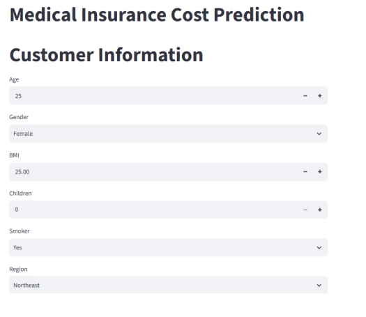
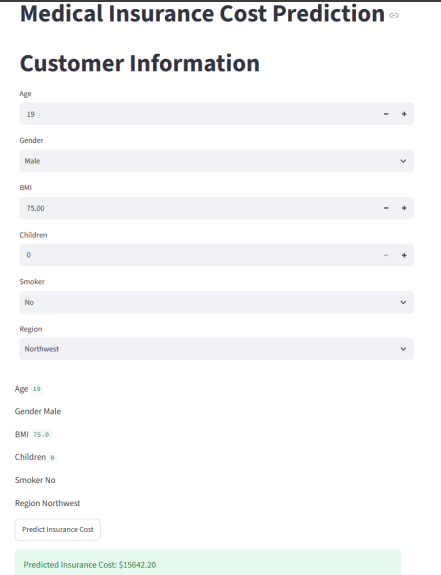
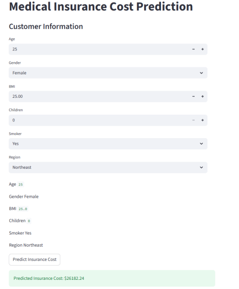
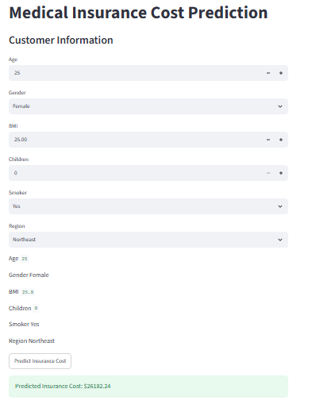

# 🏥 Medical Insurance Cost Prediction

## 📌 Project Overview

Medical expenses can vary significantly depending on factors such as age, BMI, smoking status, number of children, gender, and geographical region.

This project develops a **Machine Learning regression model** to predict estimated medical insurance costs based on customer information. A **Streamlit web application** was also developed so users can enter customer details and receive an estimated insurance cost.

The complete project covers the machine learning workflow from data preparation and exploratory analysis to model training, evaluation, prediction, and deployment.

---

## 🎯 Problem Statement

The objective of this project is to develop a machine learning model that can estimate medical insurance costs for new customers.

The application accepts the following customer information:

* Age
* Gender
* BMI
* Number of children
* Smoking status
* Region

The trained regression model processes these inputs and generates an estimated insurance cost.

---

## 🎯 Project Objectives

The main objectives of this project are:

1. Understand and analyze the medical insurance dataset.
2. Perform data preprocessing and prepare the data for machine learning.
3. Conduct exploratory data analysis (EDA).
4. Identify relationships between customer characteristics and insurance costs.
5. Train a suitable regression model.
6. Evaluate the trained model using regression metrics.
7. Use the trained model to make predictions on new data.
8. Develop a user-friendly Streamlit prediction application.
9. Deploy the application for practical use.

---

## 📊 Dataset

The project uses a medical insurance dataset containing customer demographic, health, lifestyle, and regional information.

### Dataset Features

| Feature    | Description                      |
| ---------- | -------------------------------- |
| `age`      | Age of the customer              |
| `sex`      | Gender of the customer           |
| `bmi`      | Body Mass Index                  |
| `children` | Number of children/dependents    |
| `smoker`   | Whether the customer is a smoker |
| `region`   | Geographical region              |
| `charges`  | Medical insurance cost           |

The `charges` column is the target variable that the regression model attempts to predict.

---

## 🧹 Data Preprocessing

Before training the machine learning model, the dataset was prepared for model development.

Categorical variables were converted into numerical representations so that they could be processed by the regression model.

### Gender Encoding

Gender was converted into a binary feature:

```text
Female → 0
Male   → 1
```

This produced the feature:

```text
sex_male
```

### Smoking Status Encoding

Smoking status was converted into:

```text
No  → 0
Yes → 1
```

This produced the feature:

```text
smoker_yes
```

### Region Encoding

The region variable was represented using dummy variables:

```text
region_northwest
region_southeast
region_southwest
```

Northeast was used as the reference category.

Therefore, the final model input features are:

```text
age
bmi
children
sex_male
smoker_yes
region_northwest
region_southeast
region_southwest
```

The prediction application prepares new customer information using the same feature structure before passing it to the trained model.

---

## 🔎 Exploratory Data Analysis

Exploratory Data Analysis (EDA) was performed to understand the dataset and investigate relationships between customer characteristics and medical insurance costs.

The analysis considered variables including:

* Age
* BMI
* Number of children
* Smoking status
* Gender
* Region
* Insurance charges

Visualizations and statistical analysis were used to understand patterns, distributions, and relationships within the data.

The EDA helped provide a better understanding of the factors associated with differences in insurance charges and supported the subsequent model development process.

---

## 🤖 Model Selection

Because the target variable, `charges`, is a continuous numerical value, this project is treated as a **regression problem**.

The selected machine learning model was:

**[Multiple Linear Regression]**

The model was trained using the preprocessed customer features and the insurance charges as the target variable.

---

## 🏋️ Model Training

The prepared dataset was divided into training and testing data.

The training data was used to fit the selected regression model, while the testing data was kept separate to evaluate how well the model performs on previously unseen data.

The trained model was then saved as:

```text
insurance_model.pkl
```

This saved model is loaded by the Streamlit application and used to generate predictions for new customer inputs.

---

## 📈 Model Evaluation

The trained model was evaluated using standard regression metrics.

| Metric   |                     Result |
| -------- | -------------------------: |
| MAE      |      **[4340.57]** |
| MSE      |      **[40427305.21]** |
| RMSE     |     **[6358.24]** |
| R² Score | **[0.7521]** |

### Metric Explanation

**Mean Absolute Error (MAE)**
Measures the average absolute difference between the actual insurance charges and the predicted charges.

**Mean Squared Error (MSE)**
Measures the average squared difference between actual and predicted values.

**Root Mean Squared Error (RMSE)**
Represents the square root of MSE and expresses prediction error in the same units as the target variable.

**R² Score**
Indicates how much of the variation in insurance charges is explained by the model.

---

## 🔮 Prediction Application

A Streamlit web application was developed to make the trained model accessible through a simple user interface.

The application allows the user to enter:

* Age
* Gender
* BMI
* Number of children
* Smoking status
* Region

After entering the information, the user can click:

```text
Predict Insurance Cost
```

The application then prepares the input data in the same format used during model training and passes it to the trained model.

The predicted insurance cost is displayed clearly to the user.

---

## 🧪 Test Cases

Two different test cases were performed to verify that the application can generate predictions for different customer profiles.

### Test Case 1

| Input    | Value     |
| -------- | --------- |
| Age      | 19        |
| Gender   | Male      |
| BMI      | 75.0      |
| Children | 0         |
| Smoker   | No        |
| Region   | Northeast |

**Prediction:** `[$15642.20]`

### Test Case 2

| Input    | Value     |
| -------- | --------- |
| Age      | 25        |
| Gender   | Female    |
| BMI      | 25.0      |
| Children | 0         |
| Smoker   | Yes       |
| Region   | Northeast |

**Prediction:** `[$26182.24]`

These test cases demonstrate that the application accepts different customer profiles and generates numerical insurance-cost predictions.

---

## 🖥️ Application Screenshots

### Application Interface



### Test Case 1



### Test Case 2



### Deployed Application



---

## 🚀 Deployment

The Streamlit prediction application was deployed so that it can be accessed through a web browser without requiring the user to run the application locally.

**Live Application:**
[Add your deployed Streamlit application link here]

**GitHub Repository:**
[Add your GitHub repository link here]

---

## 📁 Project Structure

```text
medical-insurance-cost-prediction/
│
├── app.py
├── insurance_model.pkl
├── requirements.txt
├── README.md
├── .gitignore
│
├── data/
│   └── insurance.csv
│
├── notebooks/
│   └── medical_insurance_prediction.ipynb
│
└── screenshots/
    ├── app_interface.png
    ├── test_case_1.png
    ├── test_case_2.png
    ├── deployed_application.png
    ├── github_repository.png
    └── project_structure.png
```

---

## 🛠️ Technologies Used

* Python
* Pandas
* Scikit-learn
* Joblib
* Streamlit
* Jupyter Notebook
* Git
* GitHub

---

## ▶️ How to Run the Project Locally

### 1. Clone the repository

```bash
git clone YOUR_GITHUB_REPOSITORY_URL
```

### 2. Open the project directory

```bash
cd medical-insurance-cost-prediction
```

### 3. Install the required libraries

```bash
pip install -r requirements.txt
```

### 4. Run the Streamlit application

```bash
streamlit run app.py
```

The application will open in your web browser.

---

## ⚠️ Limitations

This project provides an estimated insurance cost based on the available dataset and trained machine learning model.

The prediction should not be considered an actual insurance quotation or financial decision.

The model's performance depends on the quality, size, and characteristics of the training dataset. Predictions may also be less accurate for customer profiles that differ substantially from the data used to train the model.

---

## 🔮 Future Improvements

Possible improvements include:

* Testing additional regression algorithms.
* Hyperparameter tuning.
* Cross-validation.
* Improving feature engineering.
* Adding more relevant medical and demographic features.
* Improving the Streamlit dashboard.
* Adding prediction history.
* Monitoring model performance after deployment.

---

## 👨‍💻 Author

**[Hussain Ahmad]**

Medical Insurance Cost Prediction — Machine Learning Project
